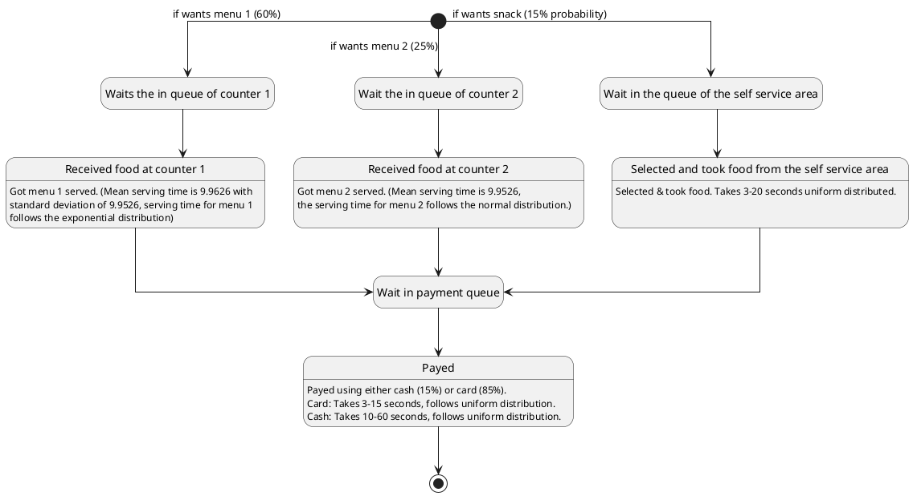

# Discrete Event Simulation
Code for the lecture Discrete Event Simulation.


```plantuml
[*] --> Automaton: Entry
Automaton: Sell coffee and softdrinks
Automaton --> [*]: Customer leaves system
```
